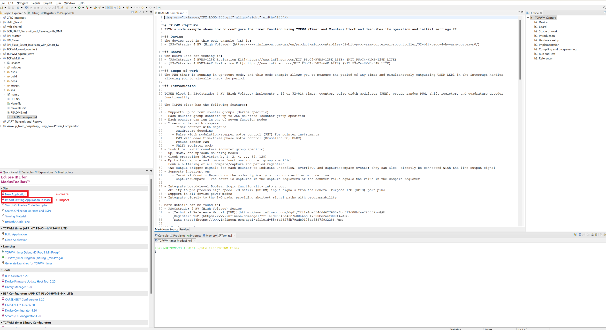
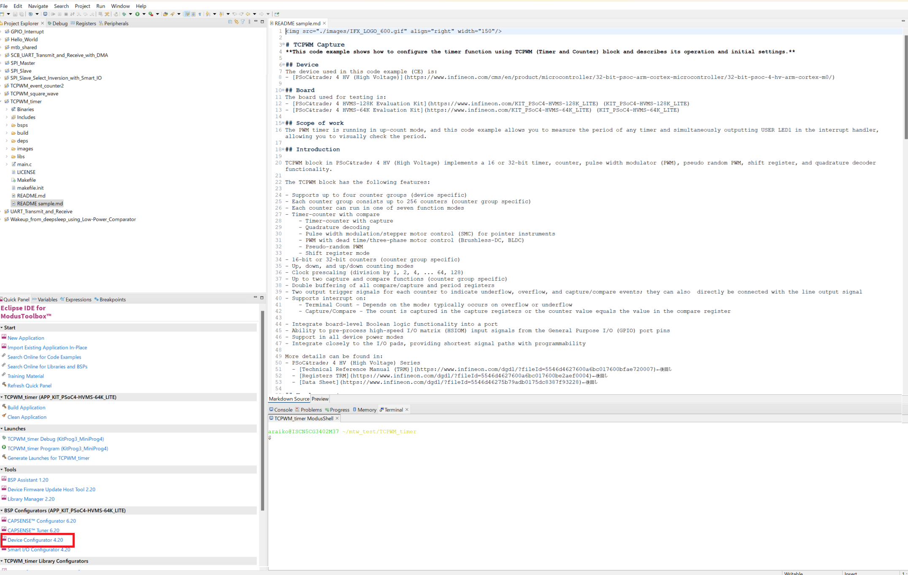
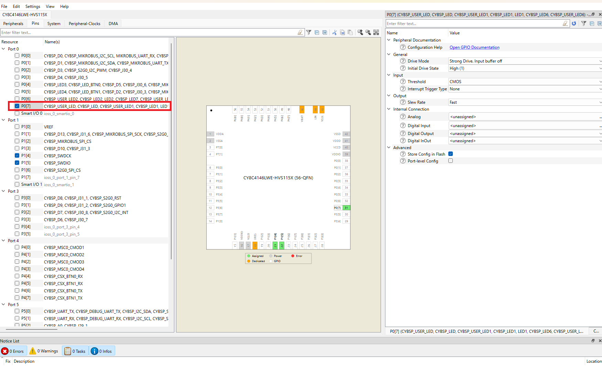
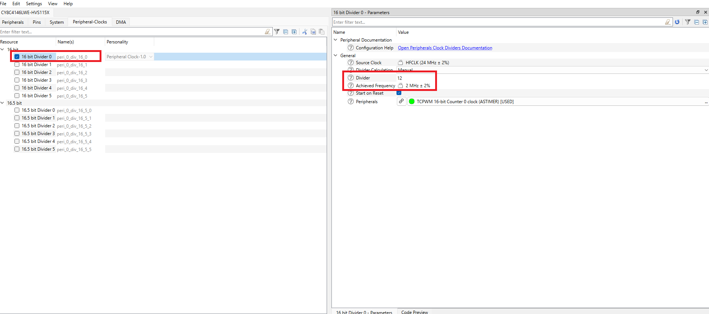
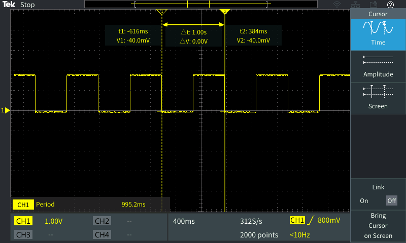

# PSoC&trade; 4: TCPWM Timer
**This code example shows how to configure the timer function using TCPWM (Timer and Counter) block and describes its operation and initial settings.**

## Device 
The device used in this code example (CE) is:
- [PSoC&trade; 4 HVMS (High Voltage Mixed Signal) series](https://www.infineon.com/cms/en/product/microcontroller/32-bit-psoc-arm-cortex-microcontroller/32-bit-psoc-4-hv-arm-cortex-m0/)

## Board
The board used for testing is:
-  [KIT_PSoC4-HVMS-128K_LITE](https://www.infineon.com/cms/en/product/evaluation-boards/psoc4_hvms_lite_kit/) 

-  [KIT_PSoC4-HVMS-64K_LITE](https://www.infineon.com/cms/en/product/evaluation-boards/psoc4_hvms_lite_kit/)

## Scope of work
The PWM timer is running in up-count mode, and this code example allows you to measure the period of any timer and simultaneously outputting USER LED1 in the interrupt handler, allowing you to visually check the period.

## Introduction  

TCPWM block in PSoC&trade; 4 HV (High Voltage) implements a 16bit timer, counter, pulse width modulator (PWM), pseudo random PWM, shift register, and quadrature decoder functionality.

The TCPWM block has the following features:

- Supports up to four counter groups (device specific)
- Each counter group consists up to 256 counters (counter group specific)
- Each counter can run in one of seven function modes
- Timer-counter with compare
    - Timer-counter with capture
    - Quadrature decoding
    - Pulse width modulation/stepper motor control (SMC) for pointer instruments
    - PWM with dead time/three-phase motor control (Brushless-DC, BLDC)
    - Pseudo-random PWM
    - Shift register mode
- 16-bit counters (counter group specific)
- Up, down, and up/down counting modes
- Clock prescaling (division by 1, 2, 4, ... 64, 128)
- Up to two capture and compare functions (counter group specific)
- Double buffering of all compare/capture and period registers
- Two output trigger signals for each counter to indicate underflow, overflow, and capture/compare events; they can also  directly be connected with the line output signal
- Supports interrupt on:
    - Terminal Count - Depends on the mode; typically occurs on overflow or underflow
    - Capture/Compare - The count is captured in the capture registers or the counter value equals the value in the compare register

- Integrate board-level Boolean logic functionality into a port
- Ability to pre-process high-speed I/O matrix (HSIOM) input signals from the General Purpose I/O (GPIO) port pins
- Support in all device power modes
- Integrate closely to the I/O pads, providing shortest signal paths with programmability

More details can be found in:
- PSoC&trade; 4 HV (High Voltage) Series
  - [Technical Reference Manual (TRM)]()
  - [Registers TRM]()
  - [Data Sheet]()

## Hardware setup
This Code example has been developed for:
- [KIT_PSoC4-HVMS-128K_LITE](https://www.infineon.com/cms/en/product/evaluation-boards/psoc4_hvms_lite_kit/)  
- [KIT_PSoC4-HVMS-64K_LITE](https://www.infineon.com/cms/en/product/evaluation-boards/psoc4_hvms_lite_kit/)  

 

  
   - **GPIO pins list**
     <table border="1" style="border-collapse: collapse">
     <thead><tr>
     <th>Board</th><th>USER_LED</th><th>Note</th></tr></thead>
     <tbody>
     <tr><td><code>KIT_PSoC4-HVMS-128K_LITE</code></td><td>P0[7]</td><td>None</td></tr>
     <tr><td><code>KIT_PSoC4-HVMS-64K_LITE</code></td><td>P0[7]</td><td>None</td></tr>
     </tbody>
     <tbody>

     </table>

## Implementation

The PWM timer is running in up-count mode, and this code example allows you to measure the period of any timer what you decided by Device Configurator and simultaneously inverted output to USER LED1 in the interrupt handler, allowing you to visually check the period.
When the counter reached not only period value but also compare value, Interrupt handler of Timer will be occurred, but at the compare value is skipped in this interrupt handler.

**ModusToolbox™ Device Configurator**

This code example project can be created or imported using ModusToolbox™ IDE. To configure the project in the **Quick Panel**, click on **Device Configurator**    

**Quick Panel**
  

**DeviceConfigurator** 
  

**Configuration TCPWM Timer**
  

**Configuration USER LED**
  

**Configuration Clock**
  

By using Device Configurator, user can easy to make voluntary value timer, and also to confirm period of interrupt handler with USER LED outputting.

- The configurations regarding the USER_LED and the clock used by TCPWM are reflected in *cybsp_init()* automatically
- The interrupt handler *Timer_Handler()* is registered by <a href="https://infineon.github.io/mtb-pdl-cat2/pdl_api_reference_manual/html/group__group__sysint__functions.html#gab2ff6820a898e9af3f780000054eea5d"><i>Cy_SysInt_Init()</i></a>, and calling *NVIC_SetPriority()* and *NVIC_EnableIRQ()* to enable the interrupt
- Then <a href="https://infineon.github.io/mtb-pdl-cat2/pdl_api_reference_manual/html/group__group__tcpwm__functions__counter.html#ga6068a06ddc8a07c67bb6df86e920944c"><i>Cy_TCPWM_Counter_Init()</i></a> enables the configured TCPWM functionality
- And finaly to Enables the counter by <a href="https://infineon.github.io/mtb-pdl-cat2/pdl_api_reference_manual/html/group__group__tcpwm__functions__counter.html#ga1707e2cc291fe486fbea346157c65bff"><i>Cy_TCPWM_Counter_Enable()</i></a> and triggers a software start by <a href="https://infineon.github.io/mtb-pdl-cat2/pdl_api_reference_manual/html/group__group__tcpwm__functions__common.html#gabeb6819a4ac18f04f943a70c44b2bbb9"><i>Cy_TCPWM_TriggerStart()</i></a>

Regarding Interrupt handler in this code example
- Firstly, this function calls <a href="https://infineon.github.io/mtb-pdl-cat2/pdl_api_reference_manual/html/group__group__tcpwm__functions__common.html#gabb00d4f53ff5db82aa6f5e5ae0e79f8a"><i>Cy_TCPWM_GetInterruptStatusMasked()</i></a> to get interrupt reason, then calls <a href="https://infineon.github.io/mtb-pdl-cat2/pdl_api_reference_manual/html/group__group__tcpwm__functions__common.html#ga0c7a2d667dc983c82327463529f5d283"><i>Cy_TCPWM_ClearInterrupt()</i></a> to clear it
- If the interrupt reason is *CY_TCPWM_INT_ON_TC*, it means reached terminal count, so the function calls <a href="https://infineon.github.io/mtb-pdl-cat2/pdl_api_reference_manual/html/group__group__gpio__functions__gpio.html#ga5c6e1b88d80a5b9fcdb215273e7cf058"><i>Cy_GPIO_Inv()</i></a> to inverse output port signal
- Although otherwise the interrupt reason is *CY_TCPWM_INT_ON_CC*, no action in this function.

**Miscellaneous settings**  

- Nothing in particular

## Compiling and programming
Before testing this code example:  
- Power the board through the dedicated power connector 
- Connect the board to the PC through the USB interface
- Build the project using the dedicated Build Application or by right-clicking the project name and selecting "Build Project"
- To program the board, in the **Quick Panel**, scroll down, and click **[Project Name] Program (KitProg3_MiniProg4)**

## Run and Test
For this example, an oscilloscope is needed to monitor user LED port pin(0_7) to check the period timing and also can confirm it by the visibility of the LED ON/OFF.  
**Figure: Timer waveform**

   

- You can debug the example to step through the code. In the IDE, use the **[Project Name] Debug (KitProg3_MiniProg4)** configuration in the **Quick Panel**. For details, see the "Program and debug" section in the [Eclipse IDE for ModusToolbox™ software user guide](https://www.cypress.com/MTBEclipseIDEUserGuide).

## References  
Relevant Application notes are:
- AN0034 - Getting started with PSOC&trade; 4 HV MS MCUs in ModusToolbox&trade;

ModusToolbox&trade; is available online:
- <https://www.infineon.com/modustoolbox>

Associated PSoC&trade; 4 HVMS MCUs can be found on:
- <https://www.infineon.com/cms/en/product/microcontroller/32-bit-psoc-arm-cortex-microcontroller/32-bit-psoc-4-hv-arm-cortex-m0/>

More code examples can be found on the GIT repository:
- <https://github.com/Infineon/Code-Examples-for-ModusToolbox-Software>

For additional trainings, visit our webpage:  
- <https://www.infineon.com/cms/en/product/microcontroller/32-bit-psoc-arm-cortex-microcontroller/32-bit-psoc-4-hv-arm-cortex-m0/#!trainings>

For questions and support, use the PSoC&trade; 4 HVMS Forum:  
- <https://community.infineon.com/t5/PSoC-4/bd-p/psoc4> 
